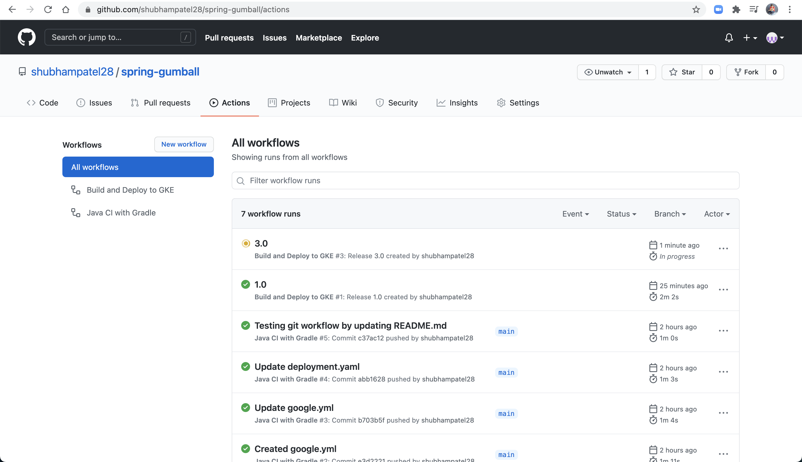

# CMPE 172 - Lab #10 Notes

In this lab, we developed CI/CD workflow and delpoyed the spring gumball application too GKE.

## CI Workflow (Part 1)

Here, I set up the workflow to trigger on push and pr on main branch and optionally upload build artifact (i.e. jar file). 

I tested the workflow by making a change to the code and commit to main branch to trigger the action.

Here is the result of my action: 

---

## CD Workflow (Part 2)

Here, I set up the CD pipeline for building and deploying the spring-gumball appliction to GKE. It triggers on "release."

* GCP Service Accoucnt & JSON Service Account Key

 

*  GitHub Action Secrets

 

* GKE Cluster Set up

 

* Git Relase Processes

 

* Google Cloud

 

* Runninng Application

